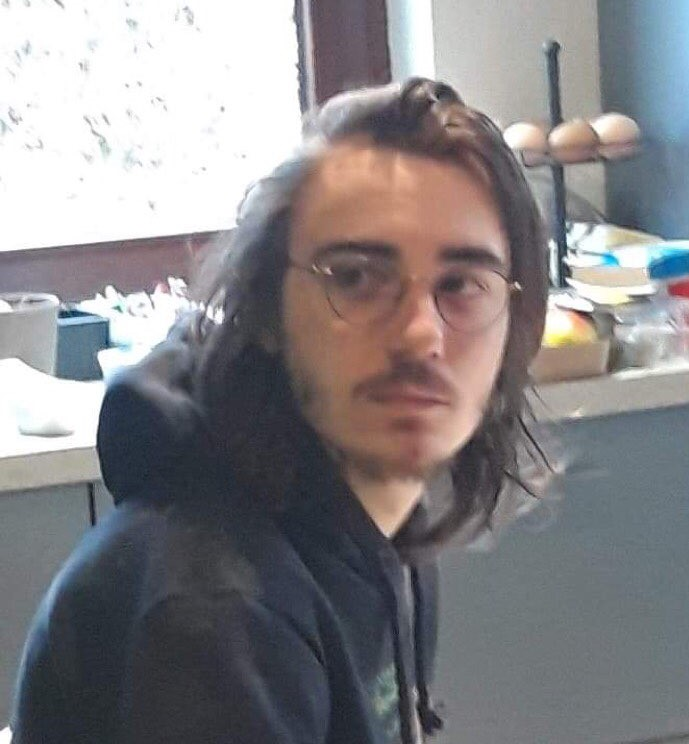

# Thomas Beaupain

*Nothing will work unless you do*

## I work hard, I think hard, I sleep hard.

| About me |  |
| ---------- |:----------|
| Birthday: | 14/03 |
| Favorite color: | Blue |
| Favorite food: | Chilli con Carne /Pizza without pineapple |
| Pineapple on pizza: | <ul><li> - [] Yes </li> <li> - [x] Normal human being (No) </li></ul> |

## Hobbies

* Video Games
* Drawing
* Music (beginner)

   - Ukulele
   
   - Bass/Guitar

   - Drums
* Programming (duh)

## You can always count on me when...

Something needs explaining, or when someone needs help. I like to take the time to bring everyone up to date :)

## A funny story

It was a long time ago... When Pokemon GO had just been released...
I was at my best friend's for the week, and we heard that Pokemon GO was finally available for download in Belgium. Hyped as never before, we decided to install it, and go to the nearest PokeStop to start our real-life Pokemon Trainer career. We ran down into his garage, got into his car, already really escited at the prospect of catching 'em all, and started the engine. He opened his garage door, laughing maniacally because we were so hyped up, and drove backward... right **into** the garage door. He had accidentally stopped the door while it was still opening, and drove straight into it. We didn't go to the nearest PokeStop, nor did we capture any Pokemon. Instead we took all the afternoon to put the door back in its tracks, and tried to close it as best as we could. Good times :)

### TL:DR 
We wanted to play Pokemon GO with my best friend, but instead drove straight into his garage door, breaking it in the process

[< < previous](https://github.com/Thibaut3005/arkdown-challenge-) THOMAS BEAUPAIN [next > >](https://github.com/William-Deville/markdown-challenge)